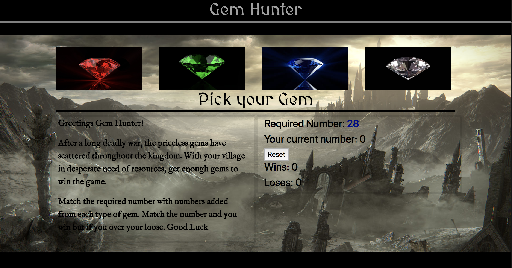

# Unit-4-game

Gem hunter game created with JQuery and Javascript. Objective is to collect gems to match total numbers with each gem having a specific number to add up. If it is a match you win but if your number is higher than the total number then you lose. 

# Link to deployed site 
[Gem Hunter](https://mawais54013.github.io/unit-4-game/)

# Link to Portfolio

[Portfolio](https://mawais54013.github.io/Bootstrap-Portfolio/portfolio.html)

# Images 



# Technology Used 
- HTML
- CSS
- Javascript
- Bootstrap
- Jquery
- Google Fonts

# Code Snippets
Code snippet of display text each header tag with id to use in JQuery
```
<div class = "col-md-6" id = "grid2">
    <!-- This has the number needed, your current number, reset button, and stats -->
    <h4>Required Number: <span id="number-to-guess"></span></h4>
    <h4>Your current number: <span id="counter-number"></span></h4>
    <button type="button" onclick="reset()">Reset</button>
    <h4>Wins: <span id="numWins"></span></h4>
    <h4>Loses: <span id="numLose"></span></h4>
    <h3 class = "head3"><span id="text1"></span></h3>
    <h3 class = "head4"><span id="text2"></span></h3>
</div>
```
Tags used here as base to play the game in JQuery on next set of codes 
```
    $("#number-to-guess").text(targetNumber);
    // From this area text is also shown on the screen
    var button = $("#button1");
    $("#numWins").text(wins);
    $("#numLose").text(loss);
    // The four cols are turned to variables to use in the Jquery
    var primes =$("#ruby");
    var sapGem = $("#sap");
    var emerGem = $("#emerald");
    var diamGem = $("#diam");
```
# Author 
[Muhammad Awais](https://github.com/mawais54013/Bootstrap-Portfolio)
